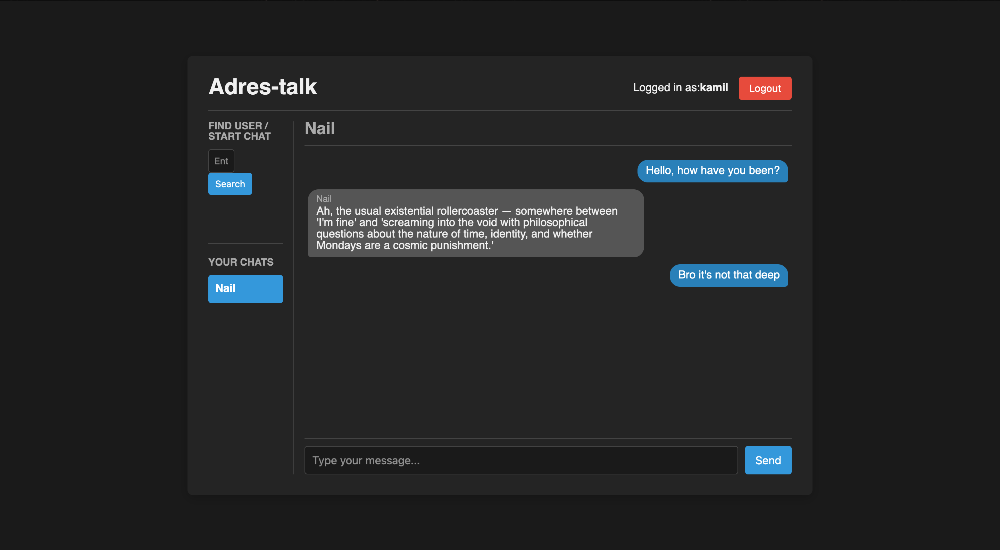

<br />
<div align="center">

<h3 align="center">Simple Messenger</h3>

  <p align="center">
    Adres-talk is a minimal messenger app built as a pet project to deepen my understanding of WebSockets and real-time communication.
    <br />
  </p>
</div>


<!-- TABLE OF CONTENTS -->
<details>
  <summary>Table of Contents</summary>
  <ol>
    <li>
      <a href="#about-the-project">About The Project</a>
    </li>
    <li>
      <a href="#getting-started">Getting Started</a>
      <ul>
        <li><a href="#try-adres-talk-for-yourself">Try Adres-talk for Yourself</a></li>
        <li><a href="#run-locally">Run locally</a></li>
      </ul>
    </li>
    <li><a href="#features">Features</a></li>
    <li><a href="#under-the-hood">Under the hood</a></li>
    <li><a href="#contact-info">Contact</a></li>
  </ol>
</details>


<!-- ABOUT THE PROJECT -->
## About The Project

Adres-talk is a simple one-page messenger app I created as a personal project to learn and experiment with WebSockets. Real-time communication has always fascinated me, and this project gave me hands-on experience with the fundamentals of live data exchange over the web.

The app features basic one-on-one messaging, with no extra complexity — just a clean, minimal interface to test real-time communication in action. It was built using Go for the backend and JavaScript, HTML, and CSS for the frontend.

Adres-talk isn’t meant to be a full-featured chat application — it’s a lightweight, educational tool that helped me understand how WebSockets work under the hood. If you're curious about the basics of real-time messaging or want a starting point for your own chat experiments, this project might be a helpful reference.



<!-- GETTING STARTED -->
## Getting Started

### Try Adres-talk for Yourself
Messenger is available at [adrestalk.cc](https://adrestalk.cc)! You can text me to try it out, my username is dafraer.
For a full list of features, check out the [Features](#features) section.

### Run Locally

You can easily run Messenger locally using Docker Compose by following these steps:

#### 1. Download the `docker-compose.yaml` file
Open your terminal and run:

```sh
wget https://raw.githubusercontent.com/dafraer/messenger/refs/heads/main/docker-compose.yaml
```  

#### 2. Set Up Architecture and  Environment Variables
- Set MONGO_URI  and SIGNING_KEY environment variables
- Choose the correct image tag based on your system architecture:
  - **For x86_64 (AMD64):** Use `4.0-amd64`
  - **For ARM64 (e.g., Raspberry Pi):** Use `4.0-arm64`

#### 3. Start the Bot
Run the following command to start Messenger in the background:

```sh
sudo docker-compose up -d
```  

Now your bot should be up and running locally!


<!-- FEATURES -->
## Features

- **Real-Time Messaging**  
  Chat instantly with other users through a simple and responsive interface powered by **WebSockets**.

- **Persistent Chat History**  
  Conversations are saved, so you can revisit past messages anytime without losing context.

AdresTalk is intentionally simple and straightforward, making it a great example of how real-time communication works under the hood.


## Under the Hood

Here's a breakdown of the tech stack behind AdresTalk:

- **Backend**  
  Built with **Go**, handling WebSocket connections,  managing real-time message flow between users and serving frontend files.

- **Frontend**  
  A one-page interface using **JavaScript**, **HTML**, and **CSS** for a clean and responsive user experience.

- **Real-Time Communication**  
  Uses **WebSockets** to enable instant messaging between users without page reloads.

- **Database**  
  Message history and user data are stored in **MongoDB**.

- **Hosting & Deployment**
    - The Go backend is deployed on [**Google Cloud Run**](https://cloud.google.com/run)
    - The MongoDB database is hosted on [**MongoDB Atlas**](https://www.mongodb.com/atlas)

    
<!-- CONTACT -->
## Contact Info

Kamil Nuriev- [telegram](https://t.me/dafraer) - kdnuriev@gmail.com
